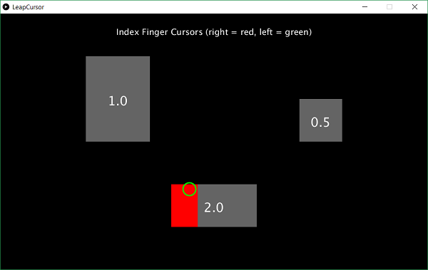

# LeapInteraction

Programm for **Processing 3** and Leap Motion. Install Leap Motion driver and library "Leap Motion for Processing" (Author: Darius Morawiec)

The programm will display two cursors on the tips of the index fingers. Three timeout buttons can be triggered by dwelling.

